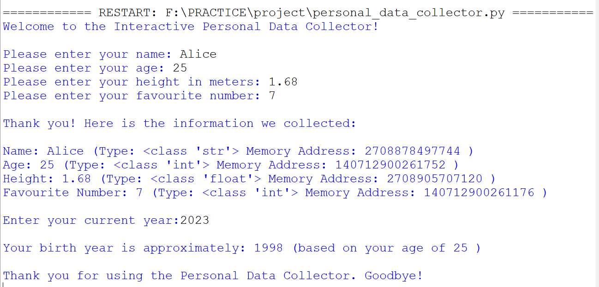

# 📋 Fundamental-Booster

## 📌 Project Overview

The **Fundamental-Booster** is a Python-based console application designed to collect, process, and display personal information entered by the user.

The program collects the user's **name, age, height, and favourite number**. It then displays each value along with its **data type** and **object identity using `id()`**. The program also calculates the user's **approximate birth year** based on the current year and age.

This project is built to demonstrate fundamental **Python programming concepts** including **input/output functions, variables, data types, type casting, arithmetic operators, and built-in functions such as `type()` and `id()`**.

---

## 🎯 Objectives

- Collect personal information from the user
- Demonstrate fundamental Python concepts
- Understand variables and different data types
- Perform type casting on user input
- Use arithmetic operators to perform calculations
- Display the data type and object identity of variables
- Create a simple and user-friendly console application

---

## 🛠️ Features

- 👤 Collect the user's name
- 🎂 Collect and convert the user's age into an integer
- 📏 Collect the user's height as a floating-point value
- 🔢 Collect the user's favourite number
- 🧾 Display all collected information in a formatted way
- 🧠 Display the data type of each variable using `type()`
- 🆔 Display the object identity of each variable using `id()`
- ➖ Calculate the approximate birth year
- 🚪 Display a thank-you message before exiting

---

## 📂 Data Structure and Variables

The program uses the following variables:

- **`name`** — String
- **`age`** — Integer
- **`height`** — Float
- **`favourite_no`** — Integer
- **`current_year`** — Integer
- **`birth_year`** — Integer

---

## 🧠 Concepts Used

### ✅ Python Fundamentals

- Variables
- Data Types
- Input/Output Operations
- Type Casting
- Built-in Functions

### ✅ Input and Output

- `input()` is used to collect information from the user
- `print()` is used to display messages and results

### ✅ Data Types

The program uses:

- `str` for the user's name
- `int` for age, favourite number, current year, and birth year
- `float` for height

### ✅ Type Casting

Type casting is used to convert user input into appropriate data types.

Examples:

- `int(float(input()))` converts the age input into an integer
- `float(input())` converts height into a floating-point number
- `int(input())` converts the favourite number and current year into integers

### ✅ Operators

The subtraction (`-`) arithmetic operator is used to calculate the approximate birth year.

```python
birth_year = current_year - age
```

### ✅ Built-in Functions

- `type()` is used to display the data type of each variable
- `id()` is used to display the object identity of each variable

---

## 🧾 Program Structure

```text
📁 Fundamental-Booster
│
├── 📄 personal_data_collector.py
├── 📄 README.md
└── 🖼️ output.png
```
---

## 🖼️ Sample Output

The following image shows a sample execution of the program:


---

## ▶️ How to Run the Program

1. Install **Python 3.x** on your system.
2. Save the program file as `personal_data_collector.py`.
3. Open Terminal / Command Prompt.
4. Navigate to the project folder.
5. Run the following command:

```bash
python personal_data_collector.py
```

## 🔄 Program Flow

1. Display a welcome message.
2. Ask the user to enter their name.
3. Ask the user to enter their age.
4. Ask the user to enter their height in meters.
5. Ask the user to enter their favourite number.
6. Display all collected information.
7. Display the data type and object identity of each variable.
8. Ask the user to enter the current year.
9. Calculate the approximate birth year using the subtraction operator.
10. Display the result.
11. Display a final thank-you message.

---

## 🎥 Project Video

<a href="https://drive.google.com/file/d/1gxkyjfOzMldPze-M5VZXojOoh2IZMee-/view?usp=sharing">
  
</a>

---

## 💻 View Source Code

<a href="https://github.com/dh-2006/Fundamental-Booster/blob/main/personal_data_collector.py">
  
</a>

---

## 🚀 Future Enhancements

- Add input validation for incorrect values
- Calculate a more accurate birth year using the user's birth date
- Create a graphical user interface using Tkinter
- Save user information using file handling
- Add multiple user records

---

## 👨‍💻 Author

**Dharmi Sonani**  
Python Developer | Student

---

## 📄 License

This project is created for **educational purposes** and is free to use and modify.

---

🚀 **Keep Learning, Keep Growing!** 🚀
